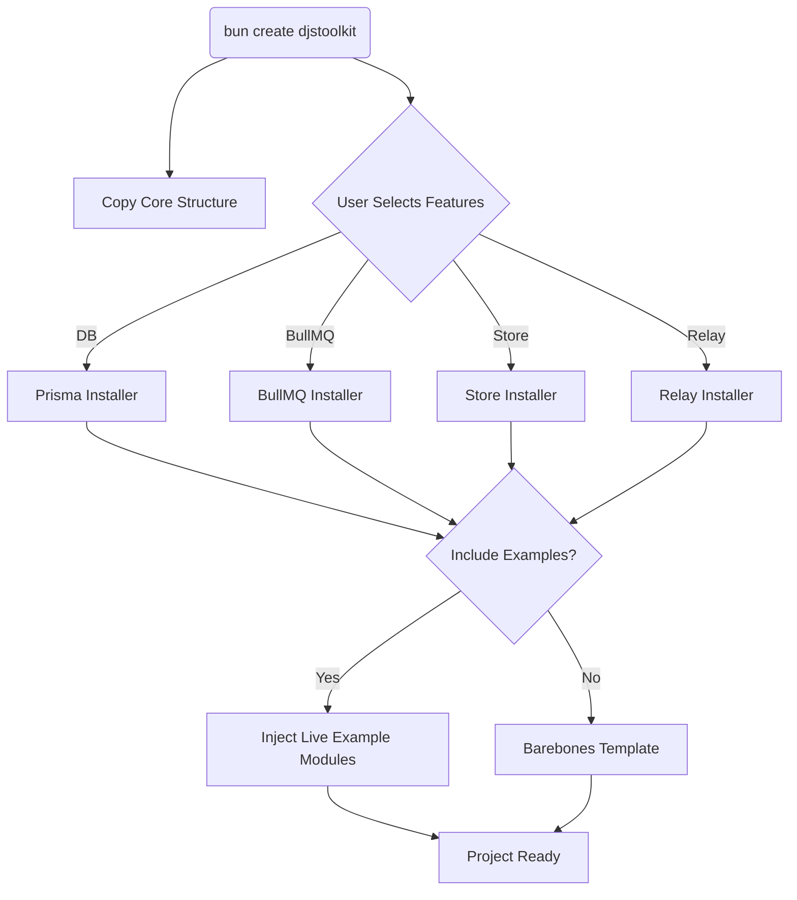

<div align="center">
  <h1>🧩 djstoolkit</h1>
  <p><strong>A fast, type-safe Discord.js scaffolding CLI powered by Bun.</strong></p>

  <!-- Badges -->
  <p>
    <a href="https://www.npmjs.com/package/create-djstoolkit">
      
    </a>
    <a href="https://www.npmjs.com/package/create-djstoolkit">
      
    </a>
    <a href="https://github.com/fakejsdev/djstoolkit/actions/workflows/publish.yml">
      
    </a>
    <a href="https://github.com/fakejsdev/djstoolkit/blob/main/LICENSE">
      
    </a>
  </p>

  <p>
    
  </p>
</div>

**djstoolkit** eliminates boilerplate, provides robust type-safety, and scales effortlessly from simple utility bots to massive applications with databases and message queues.

```bash
# Recommended (Bun-only toolkit)
bun create djstoolkit
```

> **Requirements:**
> - [Bun](https://bun.sh/) `>= 1.0.0` is strictly required to scaffold and run the generated project (Node.js is not supported).
> - **discord.js** `v14` is used under the hood.

---

## 📖 Documentation

Full documentation is available in the [`/docs`](./docs) folder:
- [Getting Started & Installation](./docs/getting-started.md)
- [Core Features (Commands, Components, Events)](./docs/core/commands.md)
- [Modular Features (DB, BullMQ, Store, Relay)](./docs/features/database.md)

---

## ⚡ Why djstoolkit?

| Feature | djstoolkit | CommandKit | Sapphire |
| :--- | :---: | :---: | :---: |
| **Primary Runtime** | 🐇 Bun (Native) | 🐢 Node.js | 🐢 Node.js |
| **Component Routing** | ✅ Stateful Prefix (`ID:uuid`) | ❌ Regex checks | ❌ Regex / Stores |
| **CLI Scaffolding** | ✅ `bun create` (A la Carte) | 🟡 Basic setup | 🟡 Basic setup |
| **Opt-in Infra (DB/Redis)** | ✅ Yes (Prisma, BullMQ) | ❌ Bring your own | ❌ Bring your own |
| **Type-Safety** | ✅ Strict (`JobRegistry`, `Relay`) | 🟡 Medium | ✅ Very Strict |
| **Learning Curve** | 🟢 Easy | 🟢 Easy | 🔴 Steep (OOP based) |
| **Handler Style** | ✅ File-based `defineX` | ✅ File-based | 🟡 Classes / OOP |

---

## ✨ Features

<details>
<summary><strong>🚀 Blazing Fast</strong></summary>
Built ground-up for Bun. Starts instantly, lints instantly via Biome, and runs incredibly fast.
</details>

<details>
<summary><strong>🎛️ Maximum Flexibility (À La Carte)</strong></summary>
Choose what you need via the CLI. Want Prisma? BullMQ? Just select them with the spacebar and the CLI wires them up.
</details>

<details>
<summary><strong>🎯 Revolutionary Component Routing</strong></summary>
Say goodbye to complicated Collectors. djstoolkit routes Buttons, Dropdowns, and Modals dynamically with session state using a smart `prefix:uuid` router.
</details>

<details>
<summary><strong>🔒 Strict Type-Safety</strong></summary>
Intelligent `JobRegistry` and `RelayRegistry` ensure you get 100% IntelliSense across your entire codebase via Module Augmentation.
</details>

<details>
<summary><strong>📁 File-Based Handlers</strong></summary>
No giant switch statements. Just drop a file in `src/modules/` and export `config` and `run`.
</details>

---

## 🚀 Quick Start

Get your bot running in three simple steps:

1. Scaffold your project:
   ```bash
   bun create djstoolkit my-bot
   ```
2. Set your environment variables in `.env` (like your Discord Token).
3. Run the development server:
   ```bash
   cd my-bot
   bun run dev
   ```

### Command Example (`defineCommand`)
Every handler follows the exact same shape. No manual registration needed.

```ts
import { defineCommand } from "@/lib/helpers/defineCommand";

export const { config, run } = defineCommand(
  { name: "ping", description: "Replies with pong" },
  async (interaction) => interaction.reply("pong")
);
```

**→ [Read the full Getting Started Guide in `/docs`](./docs/getting-started.md)**

---

## 🏗️ Monorepo Architecture

This is a monorepo containing both the CLI and the bot template it scaffolds.

```text
djstoolkit/
├── packages/
│   └── create-djstoolkit/     # The scaffolding CLI (published to npm)
├── docs/                      # Official Documentation
└── template/
    ├── core/                  # Base infrastructure, helpers, and handlers loader
    ├── examples/              # Fully working example modules for full-scaffold
    └── features/
        ├── database/          # Opt-in: Prisma ORM + PostgreSQL
        ├── bullmq/            # Opt-in: Background jobs via BullMQ + Redis
        ├── store/             # Opt-in: In-Memory TTL Cache for component state
        └── relay/             # Opt-in: Type-safe internal event bus (Pub/Sub)
```

Your generated project only touches `src/modules/` — drop your commands, events, and components there. The core infrastructure loads them automatically and should stay untouched.

### CLI Architecture Flow



`create-djstoolkit` never invents code at runtime — it copies files straight out of `template/` and wires them together based on your selections.

---

## 🛠️ Development

This is a Bun workspace. `template/core` and all features inside `template/features/` are themselves workspace packages. Each has its own `package.json` and `tsconfig.json` so you can open and edit files directly inside them with full type-checking—no need to scaffold a project first to test a change.

```bash
bun install
bun run test:typecheck  # runs structural integrity checks across all templates
```

To try a change end-to-end, run the CLI against the actual template:

```bash
cd packages/create-djstoolkit
bun src/index.ts
```

### Adding a feature

1. Add your source files under `template/features/<name>/src/`.
2. Add `dependencies.ts` (and `installer.ts`) under `packages/create-djstoolkit/src/features/<name>/`.
3. Register it in `packages/create-djstoolkit/src/features/registry.ts`.

Nothing else in the CLI needs to change.

---

## 🚧 Status & Roadmap

**Current Status**: Beta (`v0.3.x`). The core framework architecture is stable, but we are actively collecting feedback on the CLI flow and advanced routing patterns.

- [x] Core scaffolding (Commands, Components, Events)
- [x] Opt-in Database (Prisma)
- [x] Opt-in Background Jobs (BullMQ)
- [x] In-Memory Session Store
- [x] Internal Event Pub/Sub (Relay)
- [ ] Context Menu Commands
- [ ] Non-interactive CLI flags (e.g. `--yes`, `--template=full`)
- [ ] Official documentation website

---

## 🤝 Contributing

PRs are extremely welcome! If you want to add a new feature installer or improve the `example` modules, feel free to check our [open issues](https://github.com/fakejsdev/djstoolkit/issues) or submit a Pull Request. Good first issues are always tagged!

*(CONTRIBUTING.md coming soon)*

## License

[MIT](LICENSE)
